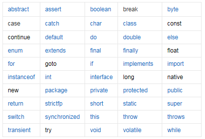
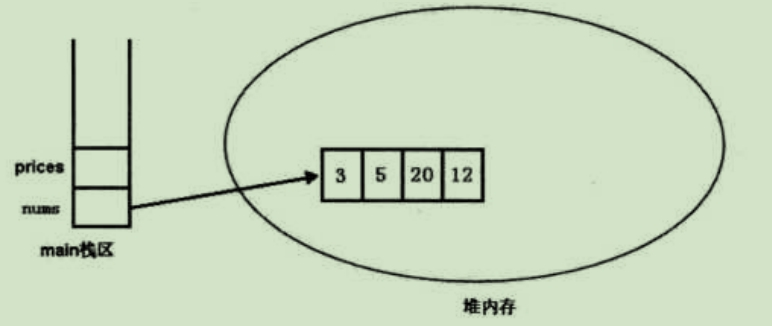

[TOC]


## 开始

### 1.Dos命令

​			* cd.. : 退回到上一级目录

​			* cd\  : 退回到根目录

​			* cd tools: 进入tools文件夹

​			* d:   : 回车	盘符切换

​			* cd d:\234 :进入d盘的234文件夹,再切换盘符(d:)才能进入d:\234

​			* dir  : 列出当前目录下的文件以及文件夹

​			* cls  : 清除屏幕

​			* ipconfig: 查看本机的相关网络配置

### 2.Java关键字




## 数据类型


### 1.基本数据类型

整数(byte、short、int、long)、小数(float、double)、字符类型(char)、布尔类型(boolean)


### 2.引用数据类型

#### 2.1数组

Java的数组只是`引用类型`的变量，`它并不是数组对象本身`，只要让数组变量指向有效的数组对象

```java
int[] nums = new int[] {3,5,20,12};
int[] prices;
//让prices数组指向nums所引用的数组
prices = nums;

//输出prices数组
for(int i = 0;i<prices.length;i++){
  System.out.println(prices[i]);
}
//将prices数组的第三个元素赋值34
prices[2] = 34;

//再访问nums数组的第三个元素
System.out.println(nums[i]);
//输出  34 

```

> 首先要明确2个概念：
>
> 1.数组对象：保存在堆内存中的连续内存空间（所以要初始化它就必须给初始化数量）
>
> 2.数组变量：只是一个引用变量（不需要初始化数量）




### 3.常量

* A: 常量的定义
  * 常量就是不变的数据量, 在程序执行的过程中其值不可以发生改变
* B: 常量分类
  * a: 整数类型
    * 十进制表示方式：正常数字   如 13、25等
    * 二进制表示方式：以0b(0B)开头    如0b1011 、0B1001 
    * 十六进制表示方式：以0x(0X)开头   数字以0-9及A-F组成  如0x23A2、0xa、0x10 
    * 八进制表示方式：以0开头   如01、07、0721
  * b: 小数类型
    * 如1.0、-3.15、3.168等
  * c: 布尔类型
    * true、false
  * d: 字符类型
    * 如'a'，'A', '0', '家'
    * 字符必须使用’’ 包裹，并且其中只能且仅能包含一个字符。
  * e: 字符串类型
    * 字符串String类型是一种引用类型，我们先了解作为常量类型的使用方式
    * 如“我爱Java”，“0123”，“”，“null”
    * 字符串必须使用“”包裹，其中可以包含0~N个字符。


### 4.变量

```java
* A: 计算机中储存和运算的最小单位是?
	* a: 一个字节,也就是一个byte.
		* win+r--cmd--回车			
	* b: 常用储存单位
		*1B（字节） = 8bit
		*1KB = 1024B
		*1MB = 1024KB
		*1GB = 1024MB
		*1TB = 1024GB
		*1PB = 1024TB
```

```java
* A: 数据类型四类八种
	*四类	八种	字节数	数据表示范围
	*整型	
		 byte	  1	  -128～127
		 short	  2	  -32768～32767
		  int	  4	  -2147483648～2147483648
		  long	  8	  -263～263-1
	*浮点型	
	    float	  4	  -3.403E38～3.403E38
		double	  8	  -1.798E308～1.798E308
	*字符型	
	 	char	  2	   表示一个字符，如('a'，'A'，'0'，'家')
	*布尔型	
		boolean	  1	   只有两个值true与false
```

* A: 	自动类型转换
  * a:表示范围小的数据类型转换成范围大的数据类型，这种方式称为自动类型转换
    自动类型转换格式：
    范围大的数据类型 变量 = 范围小的数据类型值；
    如：
    ```java
        double d = 1000;
    或
        int i = 100;
        double d2 = i;
    ```


* A: 强制类型转换
  *a: 表示范围大的数据类型转换成范围小的数据类型，这种方式称为强制类型转换
  *b: 强制类型转换格式：
  范围小的数据类型  变量 = (范围小的数据类型) 范围大的数据类型值;
  如：
  int  i = (int)6.718;   //i的值为6
  或
  double  d = 3.14;
  int  i2 = (int)d;     //i2的值为3


* A: 常见操作
  运算符	运算规则	范例		结果
  +	正号		+3		3
    +加		2+3		5
    +连接字符串	“中”+“国”	“中国”
    -负号		int a=3;-a	-3
    -减		3-1		2
    *乘		2*3		6
    /除		5/2		2
    %取模		5/2		1
    ++自增		int a=1;a++/++a	2
    --自减		int b=3;a--/--a	2
* B: 注意事项
  *a:加法运算符在连接字符串时要注意，只有直接与字符串相加才会转成字符串。
  *b:除法“/”当两边为整数时，取整数部分，舍余数。当其中一边为浮点型时，按正常规则相除。 
  *c:“%”为整除取余符号，小数取余没有意义。结果符号与被取余符号相同。
  *d:整数做被除数，0不能做除数，否则报错。
  *e:小数做被除数，整除0结果为Infinity，对0取模结果为NaN
* C:代码演示
  public class OperatorDemo1 {
  public static void main(String[] args) {
  /*
   * 常量使用算数运算符
      */
      System.out.println(10+20);

  /*
   * 变量使用算数运算符
      */
      int x = 10;
      int y = 20;
      //"+"作为加法运算使用
      int z = x + y; 
      //"+"作为连接字符串使用
      System.out.println("x="+x);
      System.out.println("y="+y);
      System.out.println("z="+z);
      }

### 5.JVM内存结构


